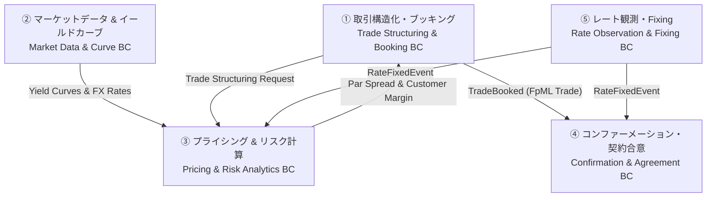

# Front-Office Pricing & Confirmation Bounded Contexts

FpML 5.12 Confirmation View のドメインモデルをリファレンスとして用いた、フロントオフィス業務（プライシング・約定・コンファーメーション）を支える「境界付けられたコンテキスト（Bounded Context）」とマイクロサービスアーキテクチャ設計の解説。

---

## 1. 全体構造とコンテキスト配置

フロントオフィスの業務フロー（詳細は [Front-Office Pricing & Confirmation Business Process Flow](../processes/pricing-and-confirmation-flow.md) 参照）および商品モデル（詳細は [Cross-Currency Swaps](../products/xccy-swap.md) 参照）に基づき、システムを5つの自律的なコンテキストに分離・定義する。

---

## 2. 各コンテキストの実務的役割と境界定義

### ① 取引構造化・ブッキング BC (Trade Structuring & Booking)
- **実務役割**: 顧客との取引条件（想定元本、通貨、期間、元本交換条件等）の構造化と契約の永続化。
- **ユビキタス言語**: Trade, Swap Stream, Notional Amount, Currency Pair, Principal Exchange
- **FpML 5.12 参照**: [`fpml-ird-5-12.xsd`](../../confirmation/fpml-ird-5-12.xsd) (`tradeHeader`, `swap`, `swapStream`)

### ② マーケットデータ & イールドカーブ BC (Market Data & Curve Engine)
- **実務役割**: OIS割引カーブ（SOFR/TONA）、Cross-Currency Basis Curve、FX Spot/Forward のリアルタイム校正（Calibration）と配信。
- **ユビキタス言語**: Yield Curve, OIS Discounting, Cross-Currency Basis Spread, FX Spot/Forward
- **FpML 5.12 参照**: [`fpml-mktenv-5-12.xsd`](../../confirmation/fpml-mktenv-5-12.xsd) (`marketQuotes`, `yieldCurve`, `fxMatrix`)

### ③ プライシング & リスク計算 BC (Pricing & Risk Analytics)
- **実務役割 (コア)**:
  1. **Par プライシング (NPV=0 ソルバー)**: 市場イールドカーブと FX スポットから、**取引の初期現在価値（NPV）をゼロにする公平な約定条件（Par Spread / Par Rate）を逆算**する。
  2. **対顧マージン反映**: セールス/ディーラーマージン（対顧スプレッド）を加味した市場提示価格の算出。
  3. **リアルタイム Greeks / リスク計算**: ポートフォリオ全体の DV01、FX Delta、Basis Delta の超高速シミュレーション。
- **ユビキタス言語**: Par Pricing, NPV = 0 Solver, Par Spread, Customer Margin, Greeks (DV01, Delta), Valuation Set
- **FpML 5.12 参照**: [`fpml-valuation-5-12.xsd`](../../confirmation/fpml-valuation-5-12.xsd), [`fpml-riskdef-5-12.xsd`](../../confirmation/fpml-riskdef-5-12.xsd) (`valuationSet`, `sensitivitySet`)

### ④ コンファーメーション・契約合意 BC (Confirmation & Agreement)
- **実務役割**: 約定後の経済条件（FpML）を外部ネットワーク（MarkitWire等）経由で対手方と照合（Matching）し、ISDA契約に基づく法的確定状態を維持。
- **ユビキタス言語**: Confirmation, Affirmation, Matching, Discrepancy (相違), ISDA Master Agreement
- **FpML 5.12 参照**: [`fpml-confirmation-processes-5-12.xsd`](../../confirmation/fpml-confirmation-processes-5-12.xsd) (`requestConfirmation`, `confirmationAgreed`)

### ⑤ レート観測・Fixing BC (Rate Observation & Fixing)
- **実務役割**: 日々の SOFR/TONA 公表レートの自動取得、OIS 複利計算（Compounding）、利払金額の確定。
- **ユビキタス言語**: Fixing Date, Compounding Period, Observation Shift, RateFixedEvent
- **FpML 5.12 参照**: [`fpml-ird-5-12.xsd`](../../confirmation/fpml-ird-5-12.xsd) (`floatingRateCalculation`, `observationShift`)

---

## 3. 自律的マイクロサービスがもたらす8つの強力な価値

1. **Polyglot Architecture**:
   - NPV=0 ソルバーや Greeks 高速計算を行う **Pricing & Risk BC** には **C++ や Rust** を採用。
   - 契約照合ワークフローの **Confirmation BC** には 相互運用の互換性を重視して**Java や Python** を採用。
2. **Bulkhead Pattern (障壁/隔壁)**:
   - 対手方から送信された不完全な FpML フォーマットエラーは **Confirmation BC** 境界で即座に遮断。**Pricing & Risk Engine** やトレーダー画面の全滅（連鎖障害）を回避。
3. **Independent Scalability**:
   - 市場ボラティリティ急昇時、**Pricing & Risk BC** のポッド数のみを 10倍〜100倍へ自動水平拡張（Auto-scaling）。動きの少ない Confirmation BC は現行規模を維持。
4. **Easy Deployment**:
   - ISDA約定ルールの改定や FpML バージョンアップ（v5.12等）の対応は **Confirmation BC** 1つに限定。大規模な計算エンジンの全社回帰テストを回避。
5. **Conway's Law / Small Teams**:
   - 「クオンツ開発チーム（Pricing BC）」と「ミドル/バックオペレーションチーム（Confirmation BC）」が各自のサービス領域を100%所有。
6. **Composability**:
   - **Rate Observation BC** が発行する `RateFixedEvent` を、Pricing BC（確定済キャッシュフローの反映）と Confirmation BC（確定金額照合）が自律受信して処理を合成。
7. **Replaceability (Strangler Fig Pattern)**:
   - `TradeCaptured` / `MarketDataUpdated` インターフェースを維持すれば、**Pricing & Risk BC** 内のライブラリを最新の評価エンジンへ安全に置換。
8. **Single Responsibility & Simplicity**:
   - Pricing BC は「NPV=0 ソルバーとリスク計算」だけに専念し、法的合意ステートを一切保持しない。開発者の認知負荷を低減。

---

## 関連 Wiki ページ
- [Cross-Currency Swaps (通貨スワップ - 商品構造)](../products/xccy-swap.md)
- [Interest Rate Derivatives (IRD - 金利デリバティブ全体)](../products/ird.md)
- [Front-Office Pricing & Confirmation Business Process Flow (業務プロセス)](../processes/pricing-and-confirmation-flow.md)
- [Business Processes (契約・清算プロセス)](../processes/business-processes.md)
