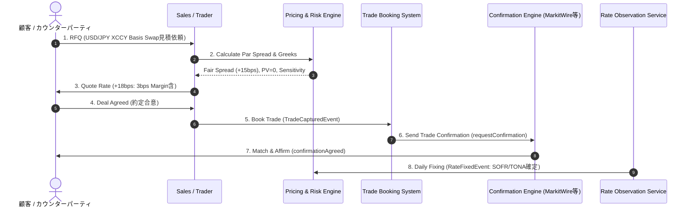

# フロントオフィス・プライシング & コンファーメーション業務フロー

デリバティブ取引（特に USD/JPY 通貨スワップ等の OTC ディーリング）における、フロントオフィスのプライシング（価格決定）から約定、コンファーメーション、期中レーティング観測（Fixing）に至る実務業務フローとビジネスイベントの解説。

---

## 1. プライシング（Pricing）業務の本質と実務目的

フロントオフィス（クオンツ / トレーダー / セールス）におけるプライシング業務の根本的な目的は、単に既存ポートフォリオの時価（NPV）を計算することではありません。
**「現在の市場環境（イールドカーブ、FXレート、ベーススプレッド等）の下で、取引の初期現在価値がゼロ（NPV = 0 / Par Swap）となる公平な約定条件（Par Spread / Par Rate）を算出し、そこに顧客マージンを上乗せしてオファー/ビッド価格を決定すること」** です。

### Par プライシングとマージン乗せの基本フロー

```
[市場環境データ入力]
 ├── SOFR OIS Discount Curve
 ├── TONA OIS Discount Curve
 ├── USD/JPY FX Spot Rate
 └── Cross-Currency Basis Curve
           │
           ▼
┌─────────────────────────────────────────────────────────────┐
│ 1. Par Pricing Solver (NPV = 0 条件の解出)                 │
│    PV(USD Leg) + PV(USD Principal) = PV(JPY Leg) + PV(JPY Principal) │
│    ⇒ フェアな Par Basis Spread (s_market) を逆算算出       │
└─────────────────────────────────────────────────────────────┘
           │
           ▼
┌─────────────────────────────────────────────────────────────┐
│ 2. Sales / Dealer Margin Adjustment                         │
│    Customer Rate/Spread = s_market + Sales Margin (m)       │
│    (例: +15 bps (市場 Par) + 3 bps (対顧マージン) = +18 bps) │
└─────────────────────────────────────────────────────────────┘
           │
           ▼
┌─────────────────────────────────────────────────────────────┐
│ 3. Trade Capture & Confirmation                             │
│    確定した約定スプレッド (+18 bps) で FpML データ生成      │
└─────────────────────────────────────────────────────────────┘
```

---

## 2. 5つの主要業務ステップとビジネスイベント



---

## 3. 各ステップの実務解説

### ステップ 1: 取引条件要求 (RFQ / Structuring)
- **業務内容**: 顧客から「USD 100M / JPY 15.5B の 5年通貨スワップ」の見積依頼（RFQ）を受信。
- **データ構造**: 想定元本、通貨ペア、始期・満期日、元本交換有無などの基本属性。

### ステップ 2: Par プライシング & リスク算出 (Market Calibration & Pricing Solver)
- **業務内容**:
  - **NPV=0 ソルバー計算**: キャッシュフロー評価エンジンが、両レグの将来キャッシュフローおよび期初・期末元本交換の現在価値の合計が等しくなる（NPV = 0）マーケット Par スプレッド（$s_{\text{market}}$）を解出。
  - **ディーラーマージン加算**: クレジットリスク（CVA）、資金調達コスト（FVA）、ディーラー利益（対顧スプレッド $m$）を算出し、提示条件 $s_{\text{quoted}} = s_{\text{market}} + m$ を決定。
  - **Greeks 算定**: デスクのポジション全体の金利感応度（DV01）、FX Delta、Basis Delta をリアルタイム計算。

### ステップ 3: 約定 & ブッキング (Execution & Trade Capture)
- **業務内容**: 提示条件で約定成立後、トレーディングシステムに取引を登録。
- **発火イベント**: `TradeCapturedEvent`
- **FpML 関連要素**: [fpml-ird-5-12.xsd](../../confirmation/fpml-ird-5-12.xsd) の `swap`（`spread` に +18bps を設定）。

### ステップ 4: コンファーメーション & 契約照合 (Trade Confirmation & Matching)
- **業務内容**:
  - バックオフィス / オペレーションシステムが、MarkitWire や DTCC などの外部照合ネットワークを経由して対手方と取引経済条件を照合（Matching）。
  - 不一致（Discrepancy: 例 - 数日の日付ズレやデイカウントミスマッチ）があれば警告・拒絶。
- **発火イベント**: `requestConfirmation` -> `confirmationAgreed`
- **FpML 参照**: [fpml-confirmation-processes-5-12.xsd](../../confirmation/fpml-confirmation-processes-5-12.xsd)

### ステップ 5: 期中レート観測 & 利払計算 (Rate Observation & Fixing)
- **業務内容**:
  - SOFR / TONA などの日々のオーバーナイト金利（Overnight Rate / 翌日物金利）を自動観測（Fixing）。
  - 計算期間末に OIS 複利（Compounding）計算を行い、確定利払金額（Fixed Amount）を算出。
- **発火イベント**: `RateFixedEvent`
- **他機能への波及**: 確定金額を確定損益（Realized PnL）として記帳し、決済システム（Payment / Settlement）へ送金キュー投入。

---

## 4. 関連 Wiki ページ
- [Cross-Currency Swaps (通貨スワップ)](../products/xccy-swap.md)
- [Interest Rate Derivatives (IRD)](../products/ird.md)
- [Business Processes](./business-processes.md)
- [Front-Office Pricing & Confirmation Bounded Contexts](../architecture/pricing-bounded-contexts.md)
